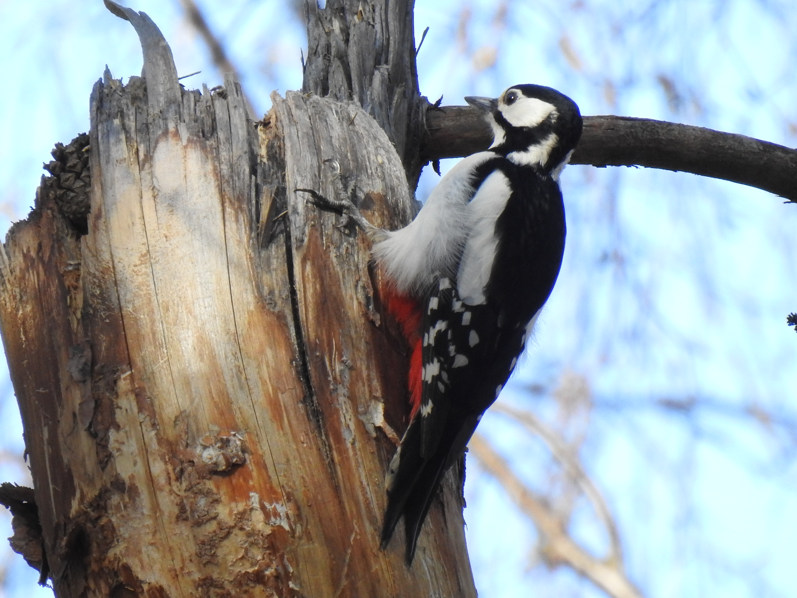
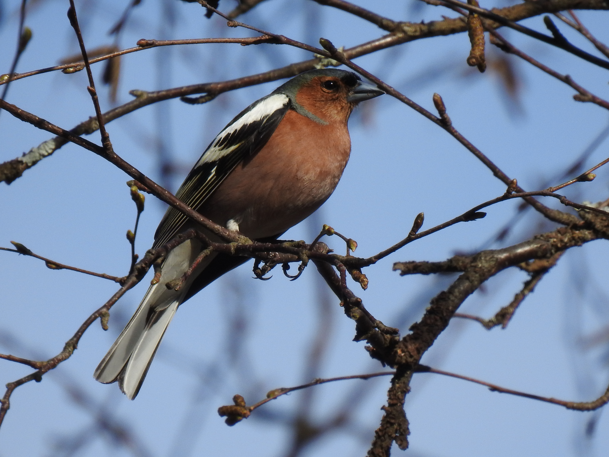
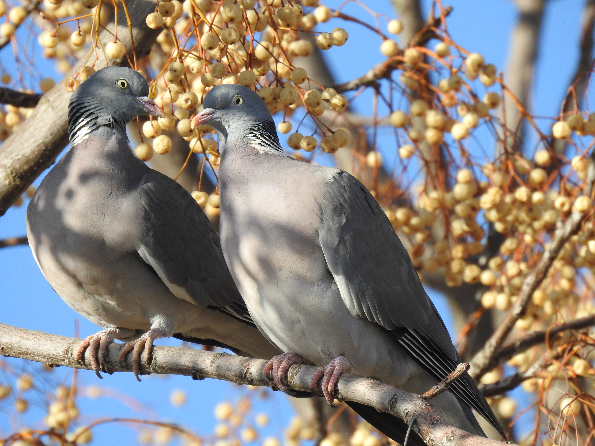
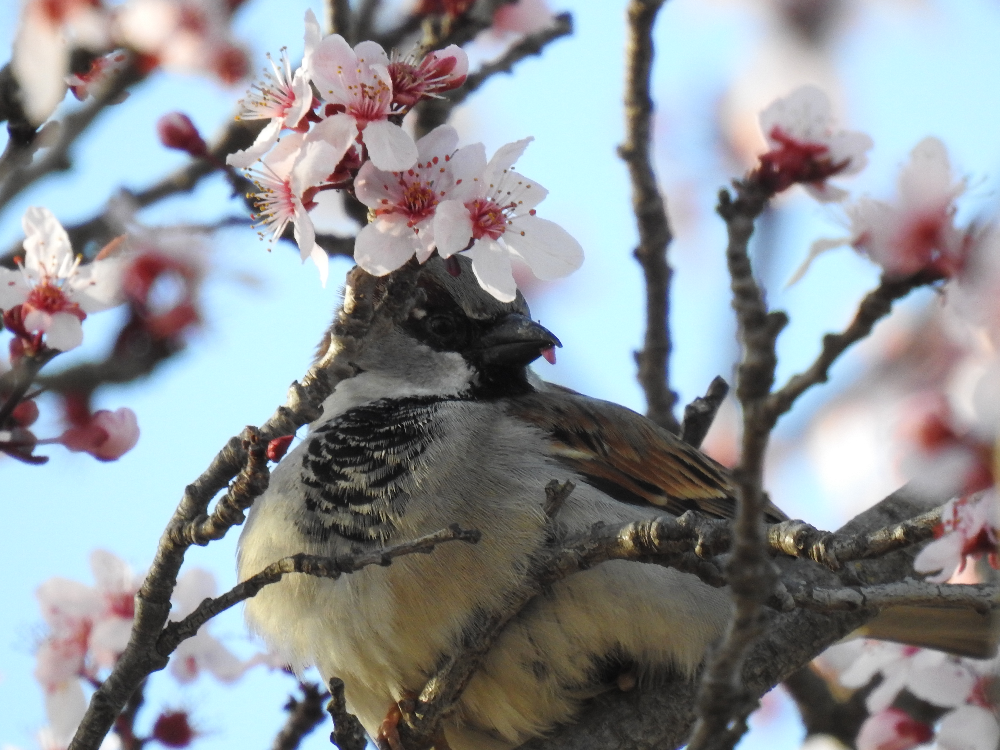
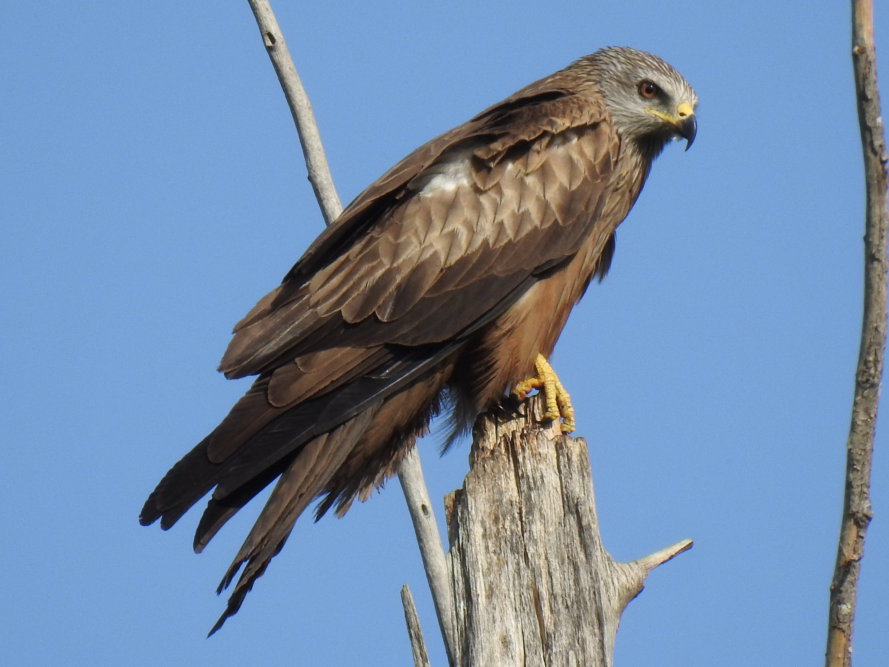
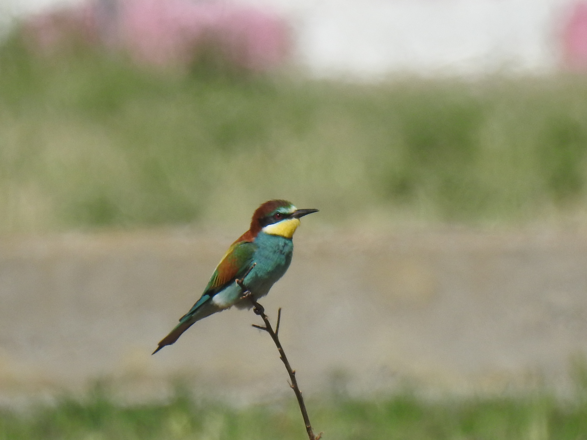
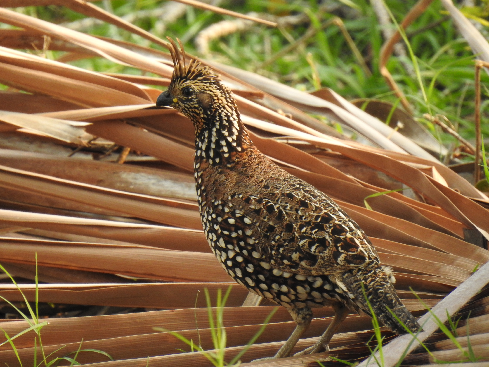
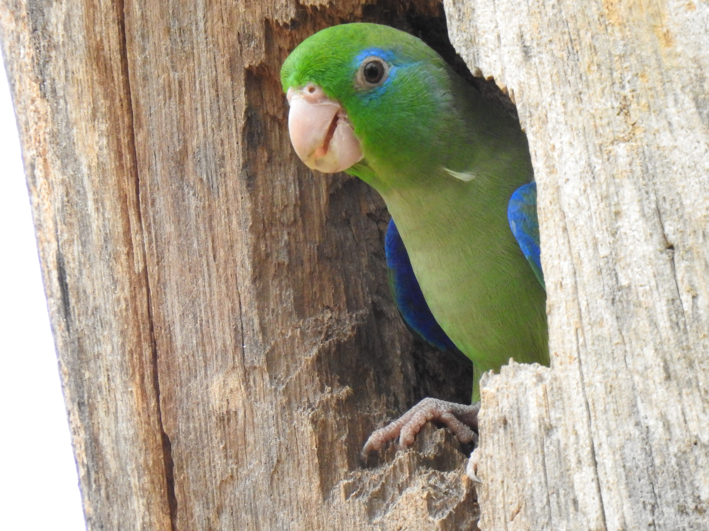

## Birds I've seen

### Europe

#### Finland 

*Dendrocopos major*             |  *Fringilla coelebs*
:-------------------------:|:-------------------------:
  |  

#### Spain

##### Lleida
*Ardea alba* 

*Columba palumbus*             |  *Paser domesticus*
:-------------------------:|:-------------------------:
  |  

 *Milvus migrans*             |  *Merops apiaster*
:-------------------------:|:-------------------------:
  |  

### Colombia

#### Universidad Nacional de Colombia (Medellin)

*Anthracothorax nigricollis*

*Thraupis episcopus*             |  *Amazilia tzacatl*
:-------------------------:|:-------------------------:
  |  

*Todirostrum cinereum*             |  *Piranga rubra*  |  *Coereba flaveola* 
:-------------------------:|:-------------------------:|:-------------------------:
  |   | 

#### La Bramadora, Santa Fe de Antioquia

*Colinus cristatus*             |  *Forpus conspicillatus*
:-------------------------:|:-------------------------:
  |  

