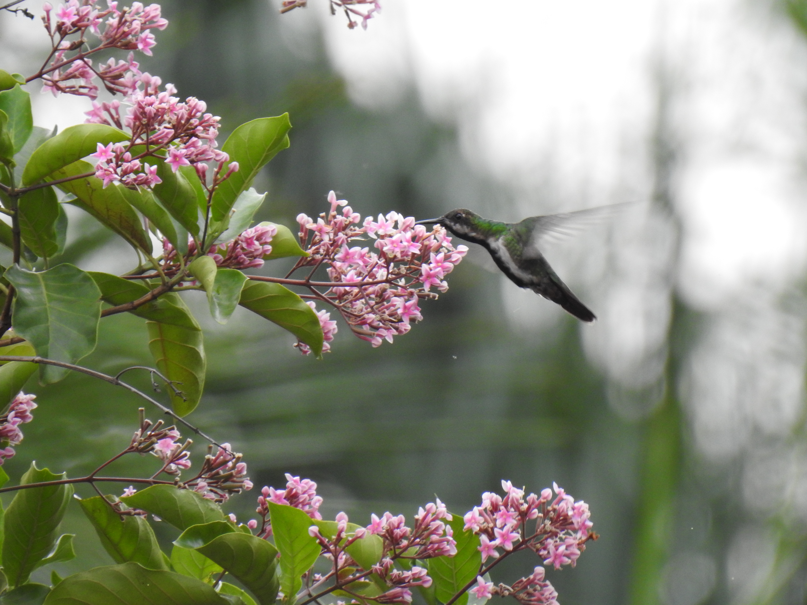
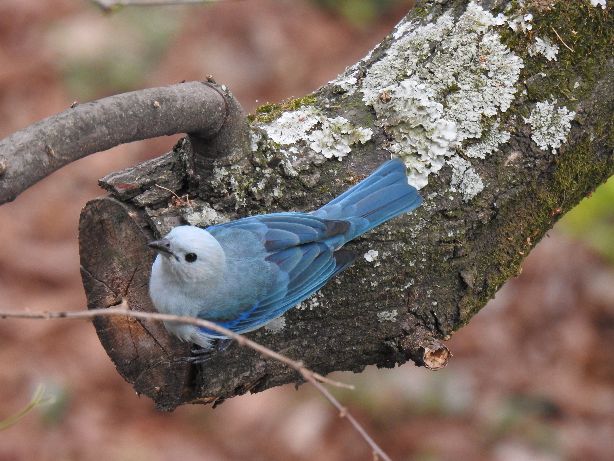
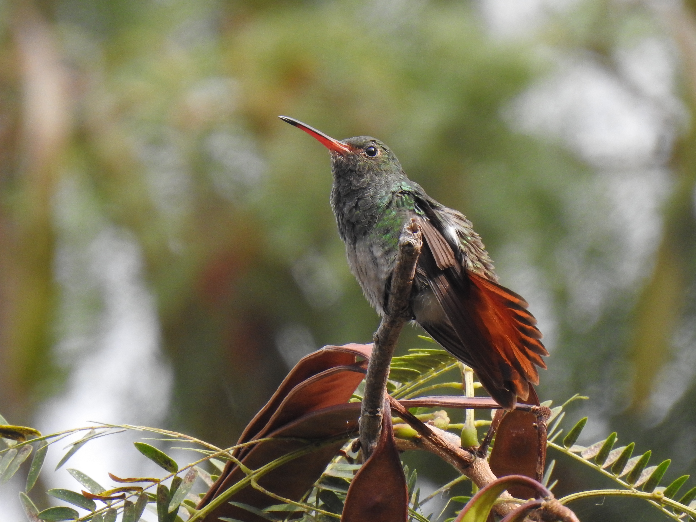
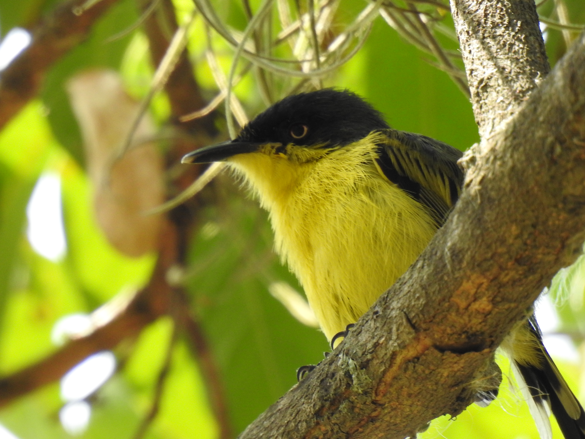
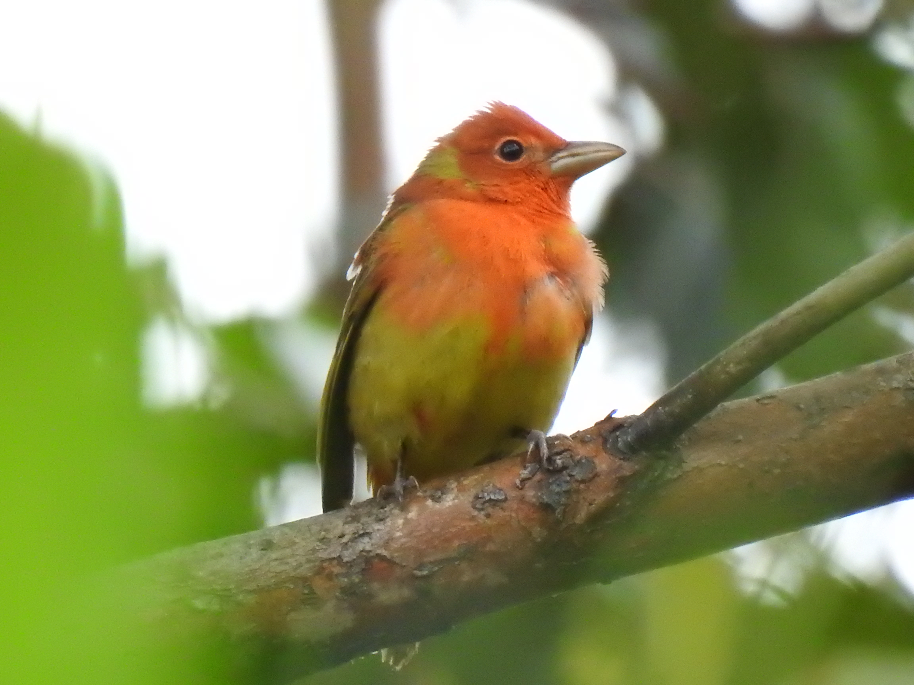
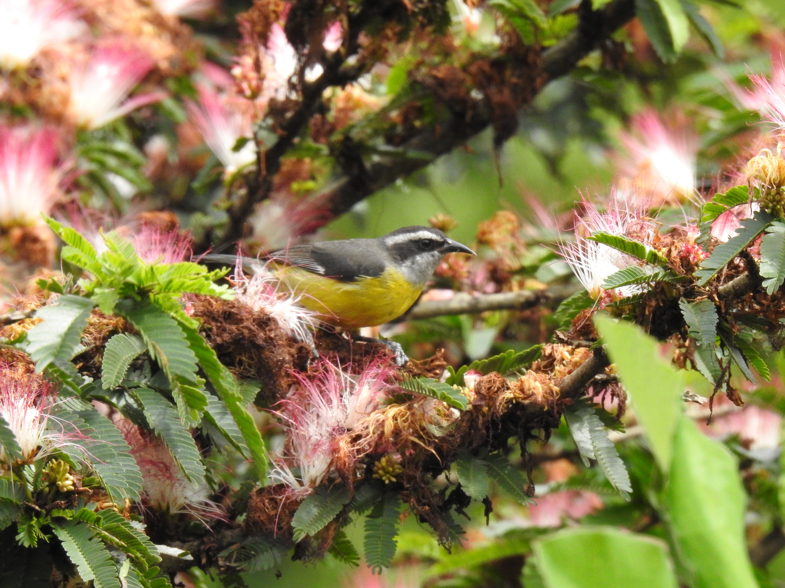

## Birds I've seen

### Europe

### Colombia

*Anthracothorax nigricollis*

*Thraupis episcopus*             |  *Amazilia tzacatl*
:-------------------------:|:-------------------------:
  |  

*Todirostrum cinereum*             |  *Piranga rubra*  |  *Coereba flaveola* 
:-------------------------:|:-------------------------:|:-------------------------:
  |   | 