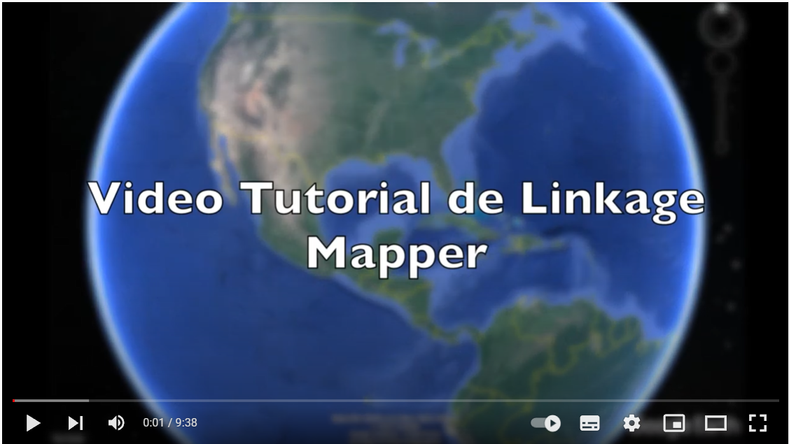

Here I want to share the process of my thesis and some useful links for those who are learning about landscape ecology like me. This webpage will be divided in at least two sections, one where I'll share some of my personal advice and tutorials based on my thesis and another one much more formal (the one you can actyually trust) with references and tutorials of experts on the field.

### My thesis

- Tutorials

- Unsolved and solved questions

    - **Selection of species**:

    For what species should we prioritize conservation efforts? This is not a trvial question, and researchers and conservation managers have been thinking about it for a while. 

    This was the first question I encountered. How should I choose the species to carry out a national analysis of connectivity?

    My objective was to propose corridors that could protect a wide range of species, this is often called a multispecies approach. However, in one of the most diverse countries in the world, trying to put all species in one box is a titanic and nonsense decision.
    
    Then, instead of focusing on species characteristics per sé, the approach was based on habitat selection and threats for a big number species.

    First the thread: It is not a secret that deforestation is a big problem in Colombia and the derived fragmentation is endangering the habitats of a miriad of species. There are species more sensitive to this fragmentation, for example those who have very restricted distributions or species with very specific prefered covers.

    This is the case of endangered species listed in the Resolución 1912 de 2017. Although this dosument has hundreds f endangered species, the focus was on mammals, because we wanted to model terrestrial connectivity and because this group is often used in connectivity analysis becuasr they are particularly sensitive to the barrier effect caused by roads, and due to the fact that areas and linkages required by them can be also used by multiple other species and ecological fluxes.

### Useful links and resources

#### THE TOOLS

- I used [Gnarly Landscape Utilities](https://circuitscape.org/gnarly-landscape-utilities/) to create my resistance surface. In the webpage you can download the tool and also tutorials provided by circuitscape.

- The one and only [Linkage mapper](https://linkagemapper.org/). 

#### Know how about corridors

The [Corridor design webpage](http://corridordesign.org/) brings you real study cases about connectivity planning and corridor design.

A very good and concise review about corridor design: [Forks in the road: Choices in Procedures for Designing Wildland Linkages](./Documents/2008_Beier etal_ConsBiol.LinkageDesigns.pdf). I used it to put my ideas in order for the creative process of my thesis. It answered a lot of my questions in just a few pages of reading.

If you are looking for something more ellaborated, they also have this manual: [Conceptual steps for designing corridors](./Documents/ConceptualStepsForDesigningCorridors.pdf)

#### Tutorials

I want to start with Steve Padgett webpage, which was the most useful resource I could have found when I was starting. Below this text, you can find a linkage mapper tutorial based on Steven's thesis carried out in Costa Rica. Check it out if you want to get a very good first glimpse of linkage mapper. I also share the link to his webpage: [Steve Padgett Webpage](http://www.stevepadgettvasquez.com/ontheweb)

